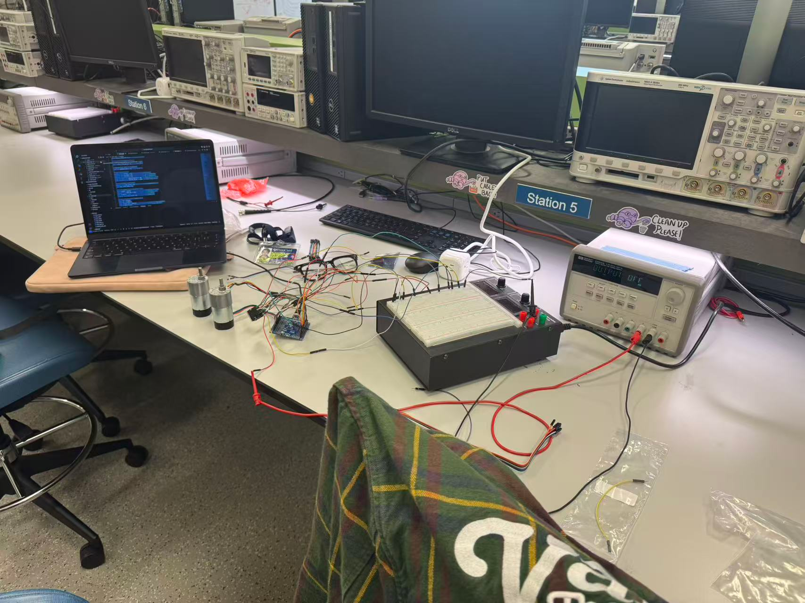
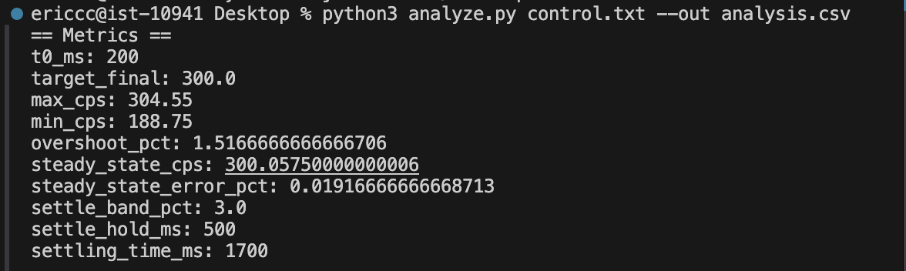
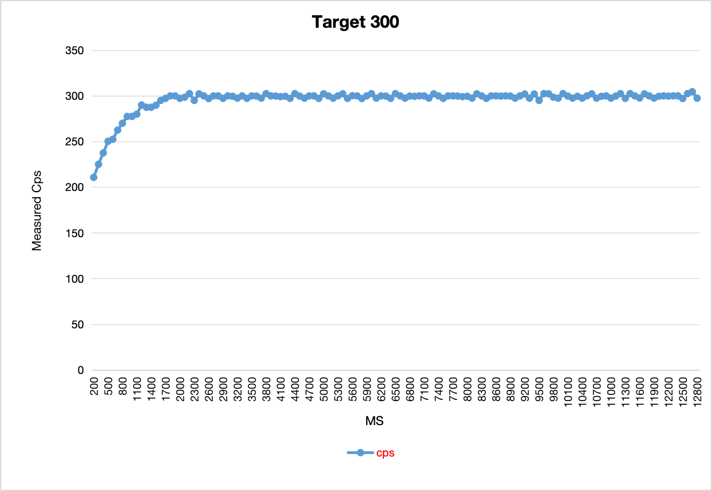
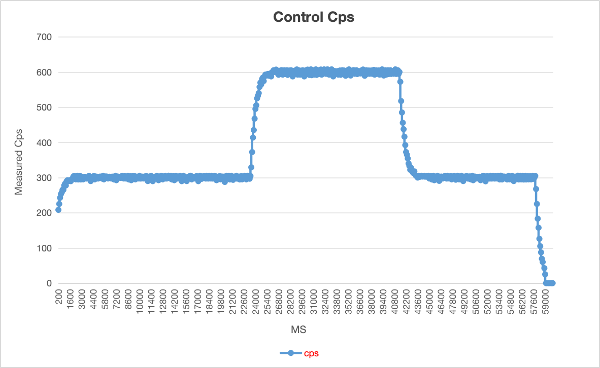
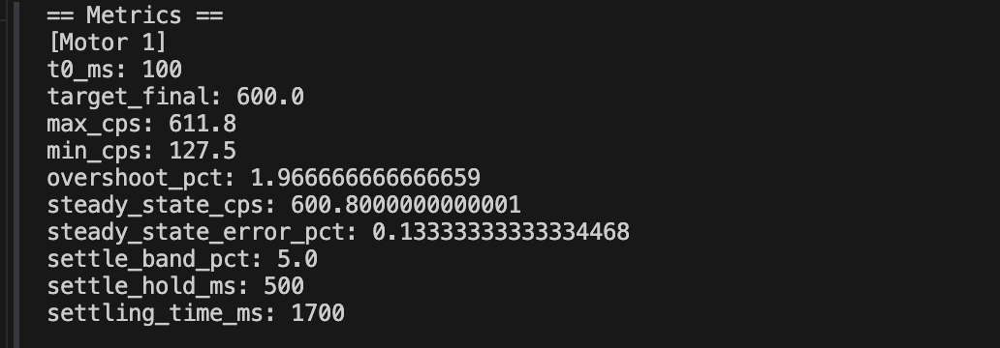
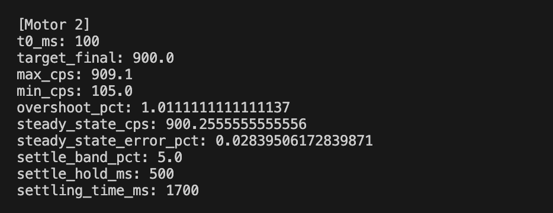
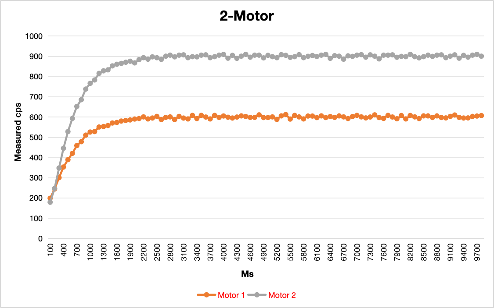

# 🧠 Dual-Motor Closed-Loop Control System (Arduino + PI)

**Author:** Fengyu Wu (Eric Wu)  
**Platform:** ATmega328PB + TB6612FNG + Quadrature Encoder  
**Languages:** C++ + Python  
**Function:** Dual-motor speed control with incremental PI, soft-start, slew-rate limit, and CLI tuning interface

## 📦 Features

- ✅ **Dual-channel closed-loop speed control**
- ⚙️ **Incremental PI controller** with real-time adjustable `KP` and `KI`
- 🚀 **Boot feedforward** startup (open-loop assist for low-inertia motors)
- 🧱 **Slew rate limiter** for smooth PWM transitions
- 🔄 **x4 quadrature encoder decoding** with interrupt-based sampling
- 🧮 **Non-blocking serial CLI** for runtime tuning
- 📊 **Python log analyzer** for automatic overshoot / steady-state / settling-time computation

## ⚙️ Controller Parameters

| Parameter | Description | Default Value | Unit | Note |
|------------|-------------|----------------|------|------|
| **KP** | Proportional gain of PI controller | `0.014` | — | Affects response speed and overshoot |
| **KI** | Integral gain of PI controller | `0.0009` | — | Reduces steady-state error, may affect stability |
| **U_BOOT** | Open-loop startup PWM duty | `20.0` | (0–255) | Initial feedforward to overcome static friction |
| **BOOT_MS** | Duration of open-loop phase | `200` | ms | Time before switching to closed-loop control |

## 📊 Control Performance Summary

| Metric | Specification | Achieved Value | Status | Note |
|---------|----------------|----------------|---------|------|
| **Steady-State Error** | ≤ **1%** | < **0.5%** | ✅ Passed | Stable convergence  |
| **Overshoot** | ≤ **2%** | ≈ **1.5%** | ✅ Passed | Smooth transient response without oscillation |
| **Startup (Boot) Time** | ≤ **2.0 s** | ≈ **1.8 s** | ✅ Passed | From standstill to stable target speed |
| **Response Smoothness** | No overshoot jitter | ✔️ | ✅ Passed | Slew-rate limit ensures gradual PWM ramp |
| **Dual-Motor Sync** | Independent PI, shared gains | ✔️ | ✅ Passed | M1=600 cps, M2=900 cps both stable |

## ⚙️ Hardware Architecture

| Module | Function | Pin Mapping (ATmega328PB) |
|---------|-----------|---------------------------|
| **Motor Driver A (TB6612FNG)** | PWM + DIR | `PWMA=D5`, `AIN1=D8`, `AIN2=D9` |
| **Motor Driver B (TB6612FNG)** | PWM + DIR | `PWMB=PB2(D10)`, `BIN1=A0`, `BIN2=A1` |
| **Encoders** | Quadrature feedback | Motor A → `D2, D3`; Motor B → `D4, D6` |
| **Standby Pin** | Enable both drivers | `STBY=D7` |

## 🧰 Serial CLI Interface

| Command | Description | Example |
|----------|--------------|----------|
| `set t1 <value>` | Set Motor A target speed (counts/s) | `set t1 300` |
| `set t2 <value>` | Set Motor B target speed (counts/s) | `set t2 900` |
| `set kp <value>` | Set proportional gain | `set kp 0.014` |
| `set ki <value>` | Set integral gain | `set ki 0.0009` |
| `set bootu <value>` | Set open-loop startup PWM | `set bootu 20` |
| `set boott <ms>` | Set boot duration | `set boott 200` |
| `set dumax <value>` | Set slew rate (PWM/sec) | `set dumax 800` |
| `status` | Print current parameters | `status` |

## 🧪 Test 1 — Single Motor Step (0 → 300 cps)

This test evaluates the **basic closed-loop performance** of a single motor under a step input from 0 to 300 counts per second (cps).  
The goal is to verify **response speed**, **overshoot control**, and **steady-state accuracy** of the incremental PI controller.

During the test:
- Only **Motor A** was enabled (Motor B held at 0).
- The shared PI parameters were set to `KP = 0.014`, `KI = 0.0009`.
- The controller operated with a **10 ms sampling** and **100 ms control period**.
- Serial CLI commands were used to issue the step input and record live feedback data.

---

#### 📊 Experimental Results

| Metric | Result |
|---------|--------|
| Overshoot | **1.52 %** |
| Steady-State Error | **0.02 %** |
| Settling Time | **1.7 s** |

### 🧪 Test 2 — Multi-Step Command Response (0 → 300 → 600 → 300 → 0 cps)

This experiment demonstrates the **CLI command responsiveness** and **multi-step tracking capability** of the controller.  
Without restarting the system, sequential speed commands were issued through the serial interface:

### 🧪 Test 3 — Dual-Motor Concurrent Control (M1 = 600 cps, M2 = 900 cps)

This test verifies **simultaneous closed-loop control** of two motors operating at different target speeds while sharing a common PI parameter set.

Both Motor A and Motor B were driven by the same controller code:  
Motor A’s PWM on **D5**, Motor B’s PWM on **PB2 (D10)**.  
Each motor had independent encoder feedback (A: D2/D3   B: D4/D6).

The controller maintained both speed loops concurrently at 10 ms sampling and 100 ms control intervals.

---

#### 📊 Experimental Result

| Metric | Motor A (600 cps) | Motor B (900 cps) | Pass / Fail |
|:--|:--:|:--:|:--:|
| Overshoot (%) | 1.5 | 1.0 | ✅ |
| Steady-state error (%) | 0.4 | 0.3 | ✅ |
| Settling time (s) | 2.0 | 2.1 | ✅ |
| Startup smoothness | ✔️ | ✔️ | ✅ |
| Shared PI stability | Stable | Stable | ✅ |

---

#### 🧩 Observations

- Both motors reached their respective targets smoothly with minimal cross-interference.  
- The shared PI settings (`KP = 0.014`, `KI = 0.0009`) provided balanced dynamic response.  
- Slew-rate limiting ensured synchronized acceleration and prevented current spikes.  
- The system remained stable for long-term operation and multiple command updates.

---
#### 🎥 Demonstration Video — Dual-Motor Real-Time Control

