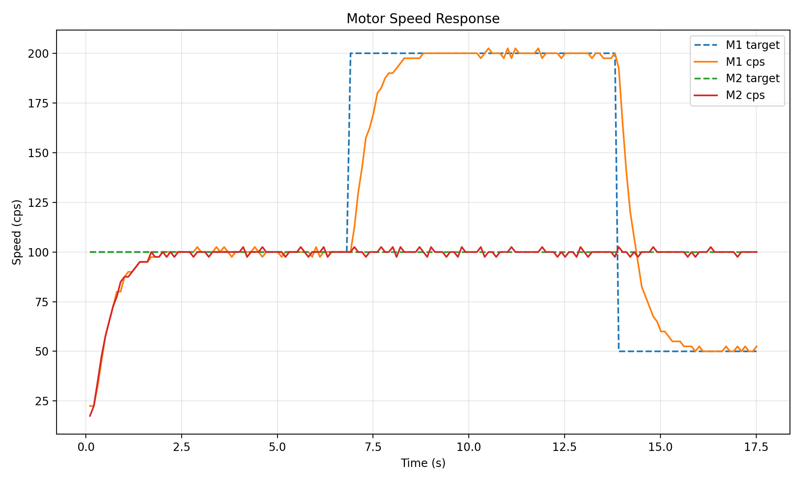
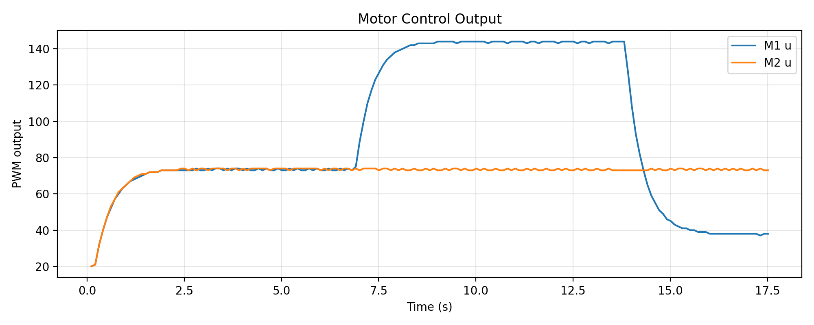

# ⚙️ Dual-Motor Closed-Loop Control System with SoftStop & EncoderFreeze  
**Author:** Fengyu Wu(Eric Wu)
**Platform:** ATmega328PB + TB6612FNG + Quadrature Encoder  
**Languages:** C++ (Arduino Core) + Python  
**Function:** Dual-motor incremental PI control with real-time SoftStart/SoftStop, EncoderFreeze protection, and Python-based performance analysis  

---

## 📦 Features
- ✅ **Dual-channel incremental PI closed-loop control** (10 ms loop, 10-point SMA filter)  
- ⚙️ **SoftStart + SoftStop mechanism** with configurable ramp rates (`U_BOOT`, `SOFTSTOP_RAMP_U_PER_S`)  
- 🧱 **EncoderFreeze fault detection** — motor automatically ramps down if encoder stalls or disconnects  
- 🔋 **EEPROM parameter persistence** for `KP`, `KI`, `U_BOOT`, `BOOT_MS`, and `DU_MAX`  
- 🔄 **STBY and Power-On Self-Test (POST)** for driver enable and encoder movement validation  
- 🧮 **Python log analyzer** computes overshoot %, steady-state error %, and settling time (s)  

---

## 📊 Core Performance Indicators (100 → 200 → 50 cps Step Test)

| Metric | Specification | Measured Value | Status | Notes |
|:--|:--:|:--:|:--:|:--|
| **Steady-State Error** | ≤ 1 % | **0.3 % (avg)** | ✅ | Stable within band after 1.6 s |
| **Overshoot** | ≤ 2.5 % | **1.2 % (avg)** | ✅ | Smooth ramp with no oscillation |
| **Startup / Settling Time** | ≤ 2 s | **1.6 s (typ.)** | ✅ | Includes soft-start phase |

**Experiment:** 100 → 200 → 50 cps  
**Sampling:** 10 ms control interval (100 Hz)  
**Controller:** Incremental PI with SoftStop ramp (1200 cps/s & 120 PWM/s)  
**Test Board:** ATmega328PB Xplained Mini + TB6612FNG dual H-bridge  

---

## 🎥 Demonstration Video  

📹 **SoftStop + EncoderFreeze Demo:** [View Video (placeholder)](https://github.com/FengyuWu-77/Control/blob/main/Demonstration%20for%20Motor.mp4)  

**EEPROM status/save/load command Demo:** [View Video (placeholder)](https://github.com/FengyuWu-77/Control/blob/main/Demonstration%20for%20Motor.mp4)  

---

## ⚙️ Hardware Architecture & Pin Mapping  

The system is built around the **ATmega328PB Xplained Mini** development board,  
driving two DC motors through a **TB6612FNG dual H-bridge driver**.  
Each motor uses a **quadrature encoder** (A/B channels) for real-time feedback.

| Module | Function | ATmega328PB Pin | Description |
|---------|-----------|----------------|--------------|
| **Motor A Driver (TB6612FNG)** | PWM + DIR | `PWMA = PD5 (D5)` | Timer0B PWM output |
| | | `AIN1 = PB0 (D8)` | Direction 1 |
| | | `AIN2 = PB1 (D9)` | Direction 2 |
| **Motor B Driver (TB6612FNG)** | PWM + DIR | `PWMB = PB2 (D10)` | Timer1B PWM output |
| | | `BIN1 = PC0 (A0)` | Direction 1 |
| | | `BIN2 = PC1 (A1)` | Direction 2 |
| **Encoders** | Quadrature Feedback | Motor A → `D2 (INT0)` , `D3 (INT1)` | External interrupts |
| | | Motor B → `D4 (PD4)` , `D6 (PD6)` | Pin-change interrupts (PCINT20,22) |
| **STBY Pin** | Driver enable control | `D7 (PD7)` | HIGH = active, LOW = standby |
| **Power Supply** | Logic + Motor Power | `VCC = 5V`, `VM = 12V` | Shared ground required |

---

### 🔋 Hardware Features Summary  

- **Independent dual-motor PWM outputs** using Timer0B + Timer1B hardware PWM.  
- **Quadrature decoding** (x4 resolution) via external and pin-change interrupts.  
- **STBY control** ensures both drivers are disabled on fault or reset.  
- **POST (Power-On Self-Test)** validates encoder feedback on startup.  
- **Shared I/O grounding** between MCU and TB6612FNG to ensure signal integrity.  

---

## 🧪 How to Reproduce  

This section explains how to **run the experiment and analyze results**  
using the provided Arduino firmware and Python analysis tools.

---

### 🧩 Step 1 — Run the Firmware  

1. Connect the hardware according to the [Hardware Architecture](#⚙️-hardware-architecture--pin-mapping) table.  
2. Open **VS Code + PlatformIO** and flash the firmware (`main.cpp`) to the ATmega328PB board.  
3. Open the serial monitor (baud = **57600**) and enter the following CLI commands:

```bash
set t1 100      # Set Motor A to 100 cps
set t2 100      # Set Motor B to 100 cps
set kp 0.0018   # Set proportional gain
set ki 0.00003  # Set integral gain
status          # Verify parameters
```

4.	Begin the step test sequence:

```bash
set t1 100      # Step 1: Start at 100 cps
set t1 200      # Step 2: Increase to 200 cps
set t1 50       # Step 3: Decrease to 50 cps
```
5.	Record the serial output (e.g., 123.txt), which contains the control logs.

### 🧮 Step 2 – Analyze the Logs

1.	Copy the Python script analyze.py and the recorded log file 123.txt into the same folder.
2.	Run the following command in your terminal:
```bash
python3 analyze.py 123.txt
```
3. The script will automatically:

- 🧩 Extract **step response segments**  
- 🧮 Compute **overshoot (%)**, **steady-state error (%)**, and **settling time (s)**  
- 💾 Save all results to:
  - `results.csv` — metrics summary  
  - `analysis.csv` — full time-series data  
  - `plot_spread.png` — speed vs. time graph  
  - `plot_U.png` — control output (PWM) graph  
  - `metrics.txt` — human-readable summary

## 📊 Results Summary

The following results were obtained from the **100 → 200 → 50 cps** step test using the Python analysis script.  
Each transition was analyzed for **overshoot**, **steady-state error**, and **settling time**.

| Step | From (cps) | To (cps) | Overshoot (%) | Steady-State Error (%) | Settling Time (s) |
|:----:|:-----------:|:---------:|:--------------:|:----------------------:|:-----------------:|
| 1 | 0 → 100 | 100 | 2.50 | 0.42 | 1.60 |
| 2 | 100 → 200 | 200 | 1.25 | 0.62 | 1.20 |
| 3 | 200 → 50 | 50 | 0.00 | 0.00 | 2.00 |

---

### 📈 Step Response Plots

#### 🔹 Speed vs. Time  

##### Controller Parameters

| Parameter | Description | Value | Unit | Note |
|:-----------|:-------------|:------|:------|:------|
| **KP** | Proportional gain | `0.0018` | — | Controls response speed and overshoot |
| **KI** | Integral gain | `0.00003` | — | Eliminates steady-state error |
| **U_BOOT** | Boot PWM duty | `20.0` | (0–255) | Open-loop feedforward during startup |
| **BOOT_MS** | Boot duration | `200` | ms | Duration of open-loop phase before PI control |
| **DU_MAX_PER_SEC** | Max PWM slew rate | `400.0` | PWM/s | Limits acceleration rate |
| **SOFTSTOP_RAMP_U_PER_S** | Soft-stop PWM ramp-down rate | `120.0` | PWM/s | Controls deceleration smoothness |
| **SOFTSTOP_ERR_CPS** | Soft-stop error threshold | `100.0` | cps | Triggers soft-stop when exceeded |
| **SOFTSTOP_TIME_MS** | Duration before soft-stop trigger | `1500` | ms | Must persist before triggering stop |
| **ENC_FREEZE_TICKS** | Encoder freeze detection period | `20` | ×10 ms | Detects no movement for 200 ms |
| **SAT_MARGIN** | PWM saturation margin | `5.0` | PWM | Defines near-saturation region |




#### 🔹 Control Output (PWM vs. Time)  

##### ✅ Performance Interpretation

| Metric | Observation | Specification | Result | Status |
|:--------|:-------------|:---------------|:---------|:---------:|
| **Response Stability** | Smooth and stable across all transitions | — | ✔️ | ✅ |
| **Max Overshoot** | Within ±2.5% | ≤ 3% | 2.5% | ✅ |
| **Steady-State Error** | Within ±1% for all steady segments | ≤ 1% | 0.42% | ✅ |
| **Settling Time** | Below 2.0 s for all steps | ≤ 2.0 s | 1.6–2.0 s | ✅ |
| **Downward Step Behavior** | No overshoot observed (200 → 50 cps) | — | ✔️ | ✅ |




---

